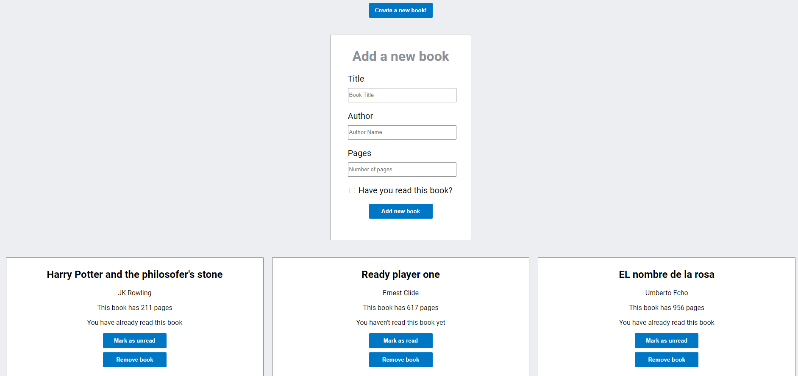

# Project Name

> This a project made for Microverse following the specifications of the odin's project course [Library](https://www.theodinproject.com/courses/javascript/lessons/library).



This project is a simple page where you can save informations about any book you want, you can save the title, author, number of pages and if you have read it or no.

## Built With

- HTML
- CSS
- JavaScript

## Live Demo

[Live Demo Link](https://johannrodriguez.github.io/Library/.)

To get a local copy up and running follow these simple example steps.

### Prerequisites
- The programing softeare of your preference
- A terminal ore terminal emulator to copy the git repository
- Git installed.
### Install
- Open your terminal in the location where you want to copy the project or use the cd command to get to the location
- Run the following command on your terminal:
```
$ git clone git@github.com:JohannRodriguez/Library.git
```
### Usage
- Open the folder where you have the project and open the index.html file
- Alternatively open the project with a Live server.

## Authors

👤 **Author1**

- Github: [@JohannRodriguez](https://github.com/JohannRodriguez)
- Twitter: [@BSapce](https://https://twitter.com/BSapce)
- Linkedin: [Johann Rodríguez](https://www.linkedin.com/in/johann-alonso-rodr%C3%ADguez-v%C3%A1zquez-25b07719a/)

## 🤝 Contributing

Contributions, issues, and feature requests are welcome!

Feel free to check the [issues page](https://github.com/JohannRodriguez/Library/issues).

## Show your support

Give a ⭐️ if you like this project!

## 📝 License

This project is [MIT](lic.url) licensed.
